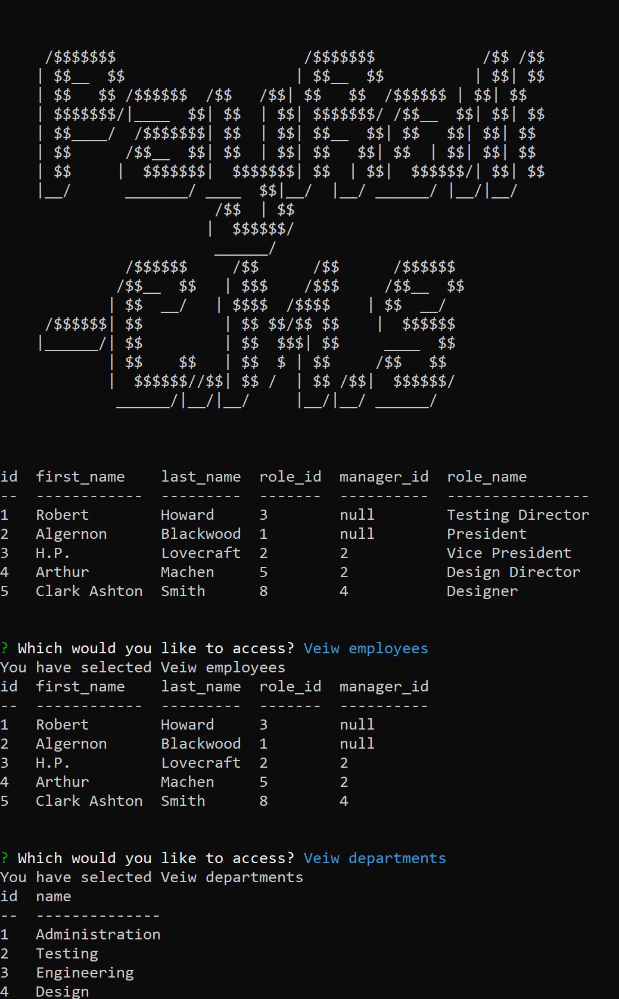

  # Payroll-C.M.S
  
  Payroll C.M.S is a comand line appliction for the management of employee data. The appliction is powered by Node.js and builds upon a sql database.
  </img>
  ## Table of Contents
  * [Installation](#installation)
  * [Usage](#usage)
  * [License](#license)
  * [Contributing](#Contributing)
  * [Tests](#Tests)
  * [Questions](#Questions)
  
  ## Installation
  To install, prior to use dowload the necessary dependant packages.
  
       
       npm install

       
    
  ## Usage
  The application is initiated with a npm run start comand, then one is prompted with a list of option to view and edit employee database. 
  
       
       npm run start

       
    
  ## License
  No License
  ## Contributing
  If one would wish to contribute simply open an issue or contact via email below
  ## Tests
  there are currently no tests set up for the project.
  ## Questions
  [Email](mailto:emailcodydiab@gmail.com)

  [GitHub](https://github.com/CodyDiab)

  [Video Demo](https://drive.google.com/file/d/13M6Vt2_4GzkVpYZDexsMxSz7XssQtXn5/view)
